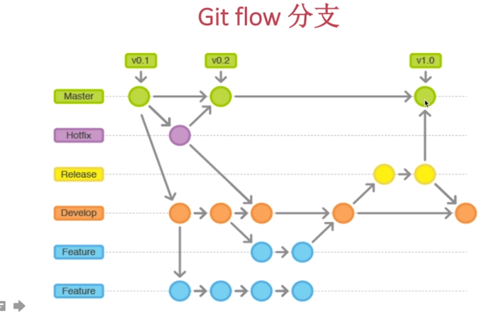

[TOC]
# Gitflow
- Gitflow 定义了一个围绕项目发布的严格分支模型
- Gitflow 仍然用中央仓库作为所有开发者的交互中心

## 功能分支
- 使用develop分支作为父分支
- 每一个新功能位于一个自己的分支
- 当新功能完成时,合并回develop分支
- 新功能提交 应该从不直接与master分支交互
- 分支名称 feature / [feature name]

## GitFlow　发布分支操作
### 发布分支操作
- 使用develop分支 作为父分支
> 这个分支值应该做bug修复、文档生成和其他面向发布的任务

> 发布完成之， 发布分支应该合并到master分支并分配一个版本号大号Tag

- 从新建发布分支以来 做的修改要合并回develop分支
- 当前发布分支名称 : release/[release version No.]
- 当前发布bug修复分支名称  : release-bugfix-[Version No.]/[bug name | bug No.]
###维护分支操作
- 唯一可以直接从master分支fork出来的分支
- 修复完成,修改应该马上合并回master分支和develop分支 
- master分支应该用新的版本号 打好Tag
- 分支名称hotfix/ [bug name | bug No.]
